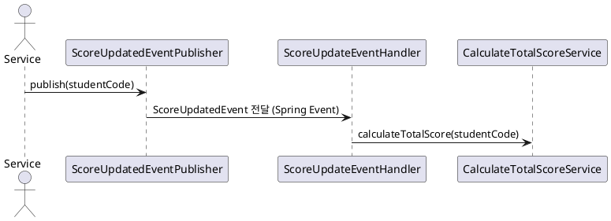

# 📊 종합 점수 계산 이벤트 사용 가이드

> 점수를 수정한 뒤, `총점 자동 계산` 처리를 간편하게 사용하기 위한 이벤트 발행 방식입니다.

---

## 🚀 빠른 사용법

### 💡 언제 사용하나요?

- 점수 변경(수정, 생성 등) 후 **자동으로 종합 점수를 재계산**해야 할 때

### 🔌 어떻게 사용하나요?

1. **DI 주입**

```java
private final ScoreUpdatedEventPublisher scoreUpdatedEventPublisher;
```

2. **이벤트 발행**

```java
scoreUpdatedEventPublisher.publish(studentCode);
```

---

## 💼 실전 예제

```java
@Service
@RequiredArgsConstructor
public class UpdateScoreService {

    private final ScorePersistencePort scorePersistencePort;
    private final ScoreUpdatedEventPublisher scoreUpdatedEventPublisher;

    public void updateScore(String studentCode, String categoryName, int value) {
        // 점수 저장
        scorePersistencePort.saveScore(...);

        // ✅ 종합 점수 재계산 요청
        scoreUpdatedEventPublisher.publish(studentCode);
    }
}
```

---

## 🧭 시각적 흐름도 (PlantUML)



---

## 🧠 왜 이벤트 방식을 선택했나요?

| 이유 | 설명 |
|------|------|
| ❌ AOP 제거 | 내부적으로 `@Aspect` + `@TriggerCalculateTotalScore`는 <br> private/protected 메서드 호출 불가, DI 순서 오류 등 한계가 있음 |
| ✅ 관심사 분리 | 점수 수정과 종합 계산을 명확하게 분리 |
| ✅ 테스트 용이성 | 이벤트 발생 여부, 처리 흐름을 독립적으로 테스트 가능 |
| ✅ 명시적 호출 | 언제 계산이 일어나는지 추적이 쉬움 |
| ✅ 순환 참조 없음 | 종속성이 단방향이라 구조 안정성 확보 |

---

## 🔍 내부 동작 원리

- `ScoreUpdatedEventPublisher`는 스프링의 `ApplicationEventPublisher`를 사용
- 이벤트는 비동기(`@Async`)로 처리되어 성능 부담 없음
- `ScoreUpdateEventHandler`에서 이벤트를 수신 후, `CalculateTotalScoreService`를 실행

---

## 📝 아쉬운 점

| 항목 | 아쉬운 점 |
|------|-----------|
| 느슨한 연결 | 자동 트리거가 아니기 때문에 실수로 호출 안 하면 계산 누락 가능 |
| 시그니처 변경 부담 | 이벤트에 studentCode 이외의 값이 필요해질 경우 확장 필요 |